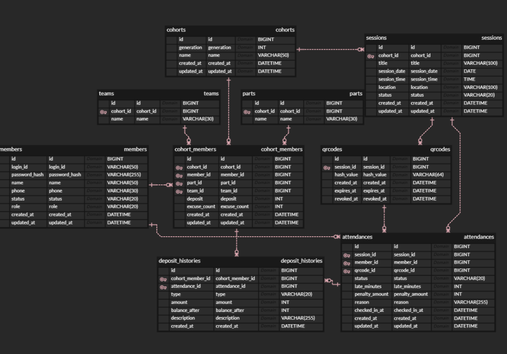
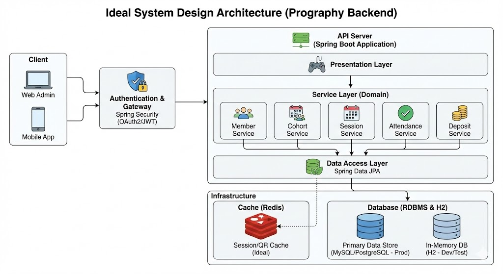

# prography-11th-backend
**프로그라피 11기 백엔드 과제 - 출결 관리 시스템**

기수 기반 IT 동아리의 회원, 일정, QR, 출결, 보증금 관리를 위한 API를 Spring Boot로 구현한 프로젝트입니다.

---

## 1. 프로젝트 개요
본 프로젝트는 프로그라피 세션 출결 관리를 위한 백엔드 시스템입니다.

**주요 기능**
* **회원 관리:** 등록 / 조회 / 수정 / 탈퇴 (Soft-delete)
* **조직 관리:** 기수 / 파트 / 팀 조회
* **일정 관리:** 일정 생성 / 수정 / 삭제 (Soft-delete)
* **QR 코드:** QR 생성 / 갱신 및 QR 출석 체크
* **출결 관리:** 관리자 출결 등록 / 수정, 출결 요약 및 목록 조회
* **보증금 관리:** 보증금 차감 / 환급 및 이력 관리

---

## 2. 개발 환경
* **Language:** Java 17
* **Framework:** Spring Boot 3.5.11
* **Build Tool:** Gradle
* **Data/ORM:** Spring Data JPA, H2 Database (In-Memory)
* **Validation/Security:** Bean Validation, BCrypt (spring-security-crypto)
* **Test:** JUnit5

---

## 3. 실행 방법 (필수)

### 3-1. 서버 실행
터미널에서 아래 명령어를 실행하거나, IntelliJ 등의 IDE에서 메인 애플리케이션을 직접 실행합니다.
```bash
./gradlew bootRun
```

### 3-2. 테스트 실행
```bash
./gradlew test
```

### 3-3. H2 Console 접속
서버 실행 후 브라우저를 통해 H2 데이터베이스 콘솔에 접속할 수 있습니다.
* **URL:** `http://localhost:8080/h2-console`
* **JDBC URL:** `jdbc:h2:mem:testdb`
* **Username:** `sa`
* **Password:** *(빈 값)*

---

## 4. 시드 데이터
서버 시작 시 테스트 편의를 위해 아래 데이터가 자동 생성되도록 구현했습니다.

* **기수:** 10기, 11기
* **파트:** 기수별 `SERVER`, `WEB`, `iOS`, `ANDROID`, `DESIGN`
* **팀:** 11기 Team A, Team B, Team C
* **관리자 계정:**
    * **loginId:** `admin`
    * **password:** `admin1234`
    * **role:** `ADMIN`
* **관리자 초기 보증금:** 100,000원 (`DepositHistory(INITIAL)` 생성)

**시드 데이터 확인용 SQL**
```sql
SELECT * FROM cohorts;
SELECT * FROM parts;
SELECT * FROM teams;
SELECT * FROM members;
SELECT * FROM cohort_members;
SELECT * FROM deposit_histories;
```

---

## 5. 구현 범위

### 📌 필수 API (16개)
* `POST /auth/login`
* `GET /members/{id}`
* `POST /admin/members`
* `GET /admin/members`
* `GET /admin/members/{id}`
* `PUT /admin/members/{id}`
* `DELETE /admin/members/{id}`
* `GET /admin/cohorts`
* `GET /admin/cohorts/{id}`
* `GET /sessions`
* `GET /admin/sessions`
* `POST /admin/sessions`
* `PUT /admin/sessions/{id}`
* `DELETE /admin/sessions/{id}`
* `POST /admin/sessions/{id}/qrcodes`
* `PUT /admin/qrcodes/{id}`

### 🚀 가산점 API (9개)
* `POST /attendances`
* `GET /attendances`
* `GET /members/{id}/attendance-summary`
* `POST /admin/attendances`
* `PUT /admin/attendances/{id}`
* `GET /admin/attendances/sessions/{id}/summary`
* `GET /admin/attendances/members/{id}`
* `GET /admin/attendances/sessions/{id}`
* `GET /admin/cohort-members/{id}/deposits`

---

## 6. 핵심 정책 반영 사항

### 👤 회원
* `loginId`는 시스템 전체에서 Unique하게 유지됩니다.
* 회원 탈퇴 시 실제 데이터를 삭제하지 않고 Soft-delete(`WITHDRAWN`) 처리합니다.
* 회원 등록 시 기수가 배정되며, 보증금 100,000원이 자동 설정되고 초기 이력이 생성됩니다.

### 🏢 기수
* 현재 운영 기수는 11기로 고정되어 있습니다.
* 일정 생성 및 출결 조회 시 설정된 기수 값을 기준으로 처리합니다.

### 📅 일정 (Session)
* 일정 생성 시 출석용 QR 코드가 자동으로 생성됩니다.
* 일정 삭제 시 Soft-delete(`CANCELLED`) 처리됩니다.
* `CANCELLED` 상태의 일정은 수정이 불가능하며, 회원용 일정 목록에서도 제외됩니다.

### 📱 QR
* UUID 기반의 `hashValue`를 사용합니다.
* 생성 시점을 기준으로 24시간 동안 유효합니다.
* 동일 일정 내 활성화된 QR은 1개만 유지됩니다.
* QR 갱신 시 기존 QR은 즉시 만료 처리되고 새로운 QR이 생성됩니다.

### ✏️ 출결 / 패널티 / 보증금
* QR 출석 체크 시 정해진 요구사항 검증 순서를 엄격하게 적용합니다.
* 일정 시작 시간을 기준으로 출석 상태(`PRESENT`, `LATE`)를 판정합니다.
* **패널티 규칙:**
    * `PRESENT` (출석): 0원
    * `ABSENT` (결석): 10,000원
    * `LATE` (지각): `min(지각분 × 500, 10,000)` 원
    * `EXCUSED` (공결): 0원
* 관리자가 출결 상태를 수정할 경우 보증금이 자동으로 조정됩니다.
    * 패널티 증가 → `PENALTY` (차감 이력 생성)
    * 패널티 감소 → `REFUND` (환급 이력 생성)
    * 변동 없음 → 이력 유지
* 공결(`EXCUSED`)은 기수당 최대 3회까지만 허용됩니다.

---

## 7. 패키지 구조
도메인(Domain) 주도적인 패키지 구조를 채택하여 응집도를 높였습니다.

```text
src/main/java/com/prography/backend
├── domain
│   ├── attendance
│   │   ├── controller, dto, entity, repository, service
│   ├── cohort
│   │   ├── controller, dto, entity, repository, service
│   ├── deposit
│   │   ├── controller, dto, entity, repository, service
│   ├── member
│   │   ├── controller, dto, entity, repository, service
│   └── session
│       ├── controller, dto, entity, repository, service
└── global
    ├── common
    ├── config
    └── exception
```
* 각 도메인 내부 `entity` 패키지에 관련된 `enum`을 포함시켰습니다.
* 데이터베이스 무결성(FK/UNIQUE)과 서비스 레이어의 검증 로직을 조화롭게 사용했습니다.

---

## 8. ERD / System Design Architecture

**ERD (Entity-Relationship Diagram)** 출결 관리 시스템의 데이터베이스 모델링입니다.  


**System Design Architecture** 본 과제의 목표 시스템 아키텍처 및 설계도입니다.  


---

## 9. 테스트

### 9-1. 서비스 레이어 단위 테스트
핵심 비즈니스 로직의 안정성을 검증하는 테스트 코드를 작성했습니다.
* `AuthServiceTest`
* `AttendanceCommandServiceTest`
* `AttendanceJudgeTest`
* `PenaltyCalculatorTest`

### 9-2. 컨트롤러 테스트
* 요청/응답 포맷 검증
* Request Body Validation 검증
* HTTP 상태 코드 검증

### 9-3. 수동 API 테스트 (Postman)
* 필수 API 16개 및 가산점 API 9개 정상 호출 확인
* **주요 정책 및 예외 케이스 검증 완료:**
    * Soft-delete 처리 확인
    * QR 갱신 및 만료 시간 검증
    * 출결 상태 수정 시 보증금 차액 정산 로직 검증
    * 중복 출결 시도 예외 처리 등

---

## 10. docs (설계 고민 흔적)
개발 과정에서 고민한 내용을 문서로 남겼습니다. (상세 내용은 `docs` 폴더 참조)
* 시스템 아키텍처 구상
* 도메인 설계 및 Aggregate 경계 설정
* 보증금 및 패널티 정책 구현 방향
* AI 사용 사례 및 피드백 정리

---

## 11. AI 사용 사례
개발 효율을 높이기 위해 AI를 보조 도구로 활용했습니다.

**사용 범위**
* 엔티티, 리포지토리, 서비스, 컨트롤러의 기본 뼈대 구조 정리
* 트랜잭션 및 글로벌 예외 처리 전략 수립
* 단위 테스트 케이스 및 엣지 케이스 아이디어 도출
* README 및 docs 문서 초안 작성

**검증 방식**
* 과제 명세서와 AI의 제안 내용 대조 및 수정
* H2 데이터베이스 콘솔을 통한 실제 데이터 적재 확인
* Postman을 이용한 수동 시나리오 테스트
* JUnit 단위 테스트 실행 및 커버리지 확인

---

## 12. 제출 요구사항 대응 체크
- [x] 잘 동작하는 Source Code
- [x] 필수 API 16개 구현
- [x] 가산점 API 9개 구현
- [x] ERD 첨부
- [x] System Design Architecture 첨부
- [x] AI 사용사례 명시
- [x] docs (설계 고민 흔적) 작성
- [x] 실행 방법 작성
- [x] 서비스 레이어 단위 테스트 작성